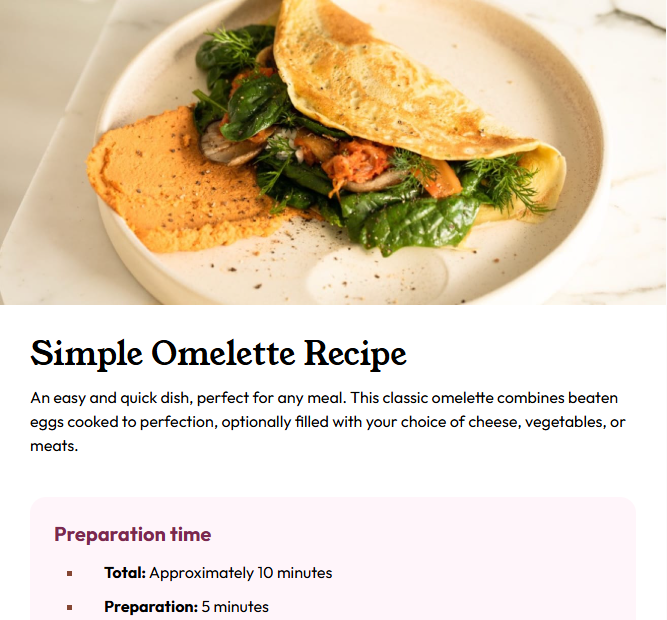
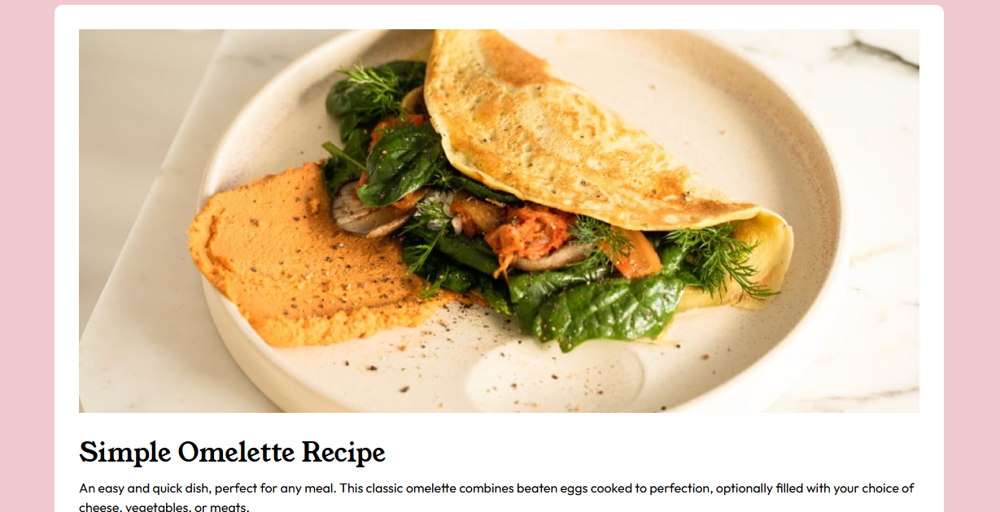

# Frontend Mentor - Recipe page solution

This is a solution to the [Recipe page challenge on Frontend Mentor](https://www.frontendmentor.io/challenges/recipe-page-KiTsR8QQKm). Frontend Mentor challenges help you improve your coding skills by building realistic projects.

## Table of contents

- [Overview](#overview)
  - [Mobile Screenshot](#mobile-screenshot)
  - [Desktop Screenshot](#screenshot)
  - [Links](#links)
- [Built with](#built-with)
- [What I learned](#what-i-learned)
- [Author](#author)

## Overview

### mobile Screenshot



### desktop Screenshot



### Links

- Solution URL: [Add solution URL here](https://your-solution-url.com)
- Live Site URL: [Add live site URL here](https://your-live-site-url.com)

## Built with

- **HTML5** (semantic elements: `main`, `section`, `article`)
- **CSS3** (custom properties, Flexbox, Grid)
- **BEM & OOCSS** for class naming and reuse
- **Mobile-first** responsive approach

## What I learned

- How to structure a page using reusable components (`.card`, `.block`, `.section`) and BEM naming.
- Using CSS variables to centralize colors and spacing for easier maintenance.
- Basic accessibility improvements (semantic markup, lists vs ordered lists, single `h1`).
- How to design mobile-first and add breakpoints for larger screens.

_Short code example I’m proud of (BEM + modifier):_

```html
<div class="block block--colored">
  <header class="block__header">Heading</header>
  <p>
    Lorem ipsum dolor sit amet consectetur adipisicing elit. Asperiores quae
    officia libero possimus ex repellat doloremque. Error ducimus ad explicabo.
  </p>
</div>
```

```css
/* Block */
.block {
  border-radius: 16px;
  padding: 2.4rem;
  overflow: hidden;
}

.block__header {
  margin-top: 0;
  font-size: 2rem;
  font-weight: 700;
  margin-bottom: 1.2rem;
}

.block--colored {
  background: var(--color-rose-two);
}

.block--colored .block__header {
  color: var(--color-rose-one);
}
```

## Author

Github - [Lewis-mbui](https://github.com/Lewis-mbui)
